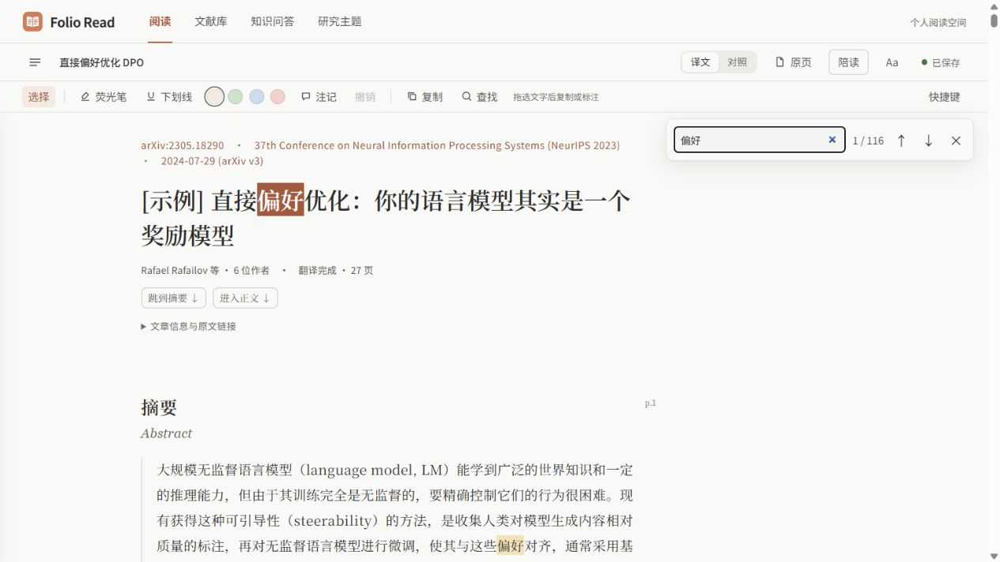

<div align="center">


# Folio Read

**论文阅读、文献管理与资料库问答**

An open-source paper reader with translation, annotations, and personal-library Q&A.

[](https://github.com/WANGRUNQIAO0915/folio-read/releases/tag/v1.1.0-dev8)
[](https://github.com/WANGRUNQIAO0915/folio-read/releases/tag/v1.0.0)
[](LICENSE)

[核心功能](#核心功能) · [下载与安装](#下载与安装) · [使用指南](#使用指南) · [平台支持](#平台支持与限制) · [开发文档](docs/development.md)

</div>

Folio Read 是面向论文阅读与个人文献管理的开源应用，集成 PDF 导入、中英对照阅读、标注笔记、文献组织与资料库问答。桌面端以 Windows 应用形式提供，手机端通过独立网页访问；两个客户端可通过用户自己的 Google Drive 同步资料库。

文献、译文和笔记保存在本机。翻译、问答及其他 AI 辅助功能使用用户配置的模型服务；应用不附带模型或 API 额度。



*阅读界面：中文正文、原文对照、标注工具与文内查找。支持浅色、深色及跟随系统主题。*

## 核心功能

| 模块 | 功能 |
| --- | --- |
| 阅读与翻译 | PDF、arXiv、DOI、论文网址及完整标题导入；后台翻译、中英对照、原 PDF 页面查看、层级目录、正文配图与手动框选。[导入说明](docs/reference-import.md) |
| 标注与笔记 | 文字复制、四色荧光笔、下划线、跨段标注、注记、文内查找、撤销与阅读进度保存。 |
| 文献组织 | 可折叠的多级文件夹、批量移动与多标签管理；打开编辑自动推荐，淡色建议留空采用，输入覆盖，保存后生效。[使用说明](docs/library-organization.md) |
| 删除与回收站 | 单篇与批量删除、删除后撤销、恢复、搜索及永久删除；保留原始外部 PDF。[使用说明](docs/deleting-papers.md) |
| 中文名称 | 单篇或批量设置中文显示名，并用于原 PDF 导出文件名；保留原题、原文件名与 PDF 内容。[使用说明](docs/chinese-pdf-names.md) |
| 资料库问答 | 面向当前论文、全部收藏或指定分类提问，可纳入个人笔记；回答区分论文依据、个人笔记与 AI 的库外补充，并提供来源定位。 |
| 研究与导出 | 比较 2–8 篇论文，保存研究主题、证据与待核实问题；导出[译文 PDF](docs/translated-pdf.md)、Markdown、Obsidian 笔记、RIS 和离线阅读文件。 |
| 云盘同步 | 通过 Google Drive 同步完整 PDF、正文、译文、批注及索引；支持经单独授权的云盘文件夹 PDF 自动导入。[同步说明](docs/mobile-sync.md) |
| 期刊与引用 | easyScholar 期刊分区查询、正文参考文献预览，以及已有 DOI 的访问入口。[配置说明](docs/journal-and-citations.md) |

以上功能以当前测试版为准。旧稳定版 v1.0.0 不包含文件夹、AI 分类、中文名称及手机云同步等后续新增功能。

dev8 新增译文 PDF 导出，可保存中文译文或逐段中英对照，并沿用当前阅读排版。详见[使用说明](docs/translated-pdf.md)与[dev8 发布说明](docs/releases/v1.1.0-dev8.md)。

## 下载与安装

### Windows

| 版本 | 定位 | 下载 |
| --- | --- | --- |
| **v1.1.0-dev8** | Windows x64 预发布测试版（未签名），新增沿用阅读排版的译文 PDF 导出 | [便携 ZIP](https://github.com/WANGRUNQIAO0915/folio-read/releases/download/v1.1.0-dev8/FolioRead-Windows.zip) · [独立 EXE](https://github.com/WANGRUNQIAO0915/folio-read/releases/download/v1.1.0-dev8/FolioRead.exe) · [发布说明与校验](https://github.com/WANGRUNQIAO0915/folio-read/releases/tag/v1.1.0-dev8) |
| **v1.0.0** | 保留的旧稳定版 | [便携 ZIP](https://github.com/WANGRUNQIAO0915/folio-read/releases/download/v1.0.0/FolioRead-Windows.zip) · [发布说明](https://github.com/WANGRUNQIAO0915/folio-read/releases/tag/v1.0.0) |

1. 下载便携 ZIP，解压到具有写入权限的文件夹。
2. 运行 `FolioRead.exe`，打开桌面应用。
3. 导入 PDF，或通过 arXiv、DOI、论文网址及完整标题查找可获取的全文。需要翻译或问答时，在设置中配置模型服务。

桌面应用无需安装 Python，依赖 Microsoft WebView2 Runtime。缺少该组件时，可从[微软官方页面](https://developer.microsoft.com/microsoft-edge/webview2/)安装。

升级前先通过「文件 → 打开数据文件夹」确认实际数据位置，再退出旧程序并备份整个数据目录。替换程序时保留原数据目录。测试包的应用内部版本为 `1.1.0.dev8`，本次新增功能参见[更新记录](CHANGELOG.md)。

### 手机网页 / PWA

使用手机浏览器打开[手机版](https://wangrunqiao0915.github.io/folio-read/mobile/)。iPhone 可通过 Safari 的分享菜单选择「添加到主屏幕」，独立导入 PDF、阅读、批注及检索资料库。

手机版网站维持既有部署；本次 dev8 仅发布 Windows 包，不更新手机网页 / PWA，也不发布 Android APK。手机功能范围与平台限制见下文。已安装的 PWA 收到更新提示后，关闭所有该站点页面并重新打开即可加载新资源。安装、模型配置与同步流程见[手机端文档](docs/mobile-sync.md)。

## 使用指南

### 配置模型服务

| 方式 | 配置要求 |
| --- | --- |
| DeepSeek 或兼容 API | 服务地址、模型名称与个人 API Key。 |
| 本机推理服务 | 已运行的兼容 API 服务、模型及必要的认证信息。 |
| Codex / Claude CLI | 在电脑上安装并登录相应 CLI；应用调用其模型配置。 |

手机端使用自行配置的 HTTPS API，服务须允许网页跨域访问；手机端不能调用电脑上的 CLI 或本机模型。远端 API 与 CLI 可能将任务材料发送至相应服务，本机安装客户端不代表模型在本地推理。

### 整理论文

在文献库创建逻辑文件夹，导入时选择目标位置，或对已有论文进行批量整理。文件夹与标签属于资料库元数据，不对应磁盘或 Google Drive 的实际目录。

中文名称可手工填写，也可基于本地标题信息生成建议。分类编辑默认自动向已配置的 API 模型请求建议，可关闭「打开时自动推荐」；接收服务与发送文本可在 AI 设置中查看。名称翻译保留发送前确认。检查或修改结果后保存。AI 译名标注为「AI 翻译（非官方中文题名）」。文件夹、标签和已确认的中文名称随资料库同步。分类与改名不会移动原 PDF，也不会重命名云盘原文件。

AI 分类每篇按需建议 0–4 个标签，不要求凑满四个；优先选择已有文件夹，默认允许每批最多建议一个新主题，可在 AI 设置中关闭。手动标签和旧记录不受这个数量限制。

### 阅读与提问

当前测试版支持[删除与回收站](docs/deleting-papers.md)：选中论文后在详情里删除，或勾选多篇批量删除；先进入回收站，可恢复或再次确认后永久删除。运行中的任务须先停止，删除不会强行取消翻译。本机移除不会自动删除云盘或其他设备副本。

阅读页支持中文正文、英文对照与原 PDF 页面切换。选中文字后，可通过工具栏或快捷键复制、标注和添加注记。

右侧的「原文核对提示」默认关闭，可在「设置 → 翻译」中重新开启；已有核对记录保留。此选项控制 AI 对原文疑点的提示，翻译完整性、JSON 格式和公式检查仍会执行。

| 快捷键 | 操作 |
| --- | --- |
| `Ctrl+F` | 查找当前页面；`Enter` / `Shift+Enter` 切换结果。 |
| `Ctrl+Shift+H` / `Ctrl+Shift+U` | 添加荧光笔 / 下划线。 |
| `Ctrl+Shift+N` | 为选区或当前段落添加注记。 |
| `Ctrl+Z` | 在正文中撤销本次新建标注；在文本框中撤销编辑。 |
| `Esc` | 退出连续标注模式。 |

在「知识问答 → 问资料库」选择全部收藏或指定分类；阅读页的「陪读」面板可切换当前论文与整个资料库。检索使用有限的相关片段，未命中不代表库内不存在相关内容；模型回答及引用需结合原文核对。

完整操作见[阅读工具与快捷键](docs/reading-tools.md)。

### 导出译文 PDF

阅读页顶栏选择「导出 PDF」，默认中文译文，也可选择「逐段中英对照」。Windows 桌面版通过 WebView2 直接保存；从源码运行的网页模式或单文件离线 HTML 使用浏览器打印窗口，请选择「另存为 PDF」。

- 沿用当前阅读页实际使用的字体、字号、行距、字距、段距及图表公式样式。正文宽度能放入纸张时保留，超出可打印区域时才收窄。
- 采用 A4 白底、15 mm 页边距，深色主题转为浅色印刷配色。分页及过宽内容适配可能改变换行、图表所在页和页码，不保证与阅读页或原 PDF 的版面一致。
- 使用已有译文和最新修改，不调用模型。正在编辑的内容需先保存或取消；浏览器中尚未写入磁盘的修改会提示。缺译保留原文或原页，缺图尝试原页回退，仍缺失的内容会明确提示。
- 保留可用图片、图注、公式、表格和参考文献；阅读笔记、AI 边注、划线和高亮不会写入导出文件。原 PDF 下载保持独立，导出不会改动原始 PDF。

保存、取消、覆盖保护和详细限制见[译文 PDF 导出](docs/translated-pdf.md)。

## 数据与隐私

- **本地存储**：文献、模型配置、标注、笔记和研究记录保存在本机。独立 EXE 通常在程序旁创建「FolioRead数据」；已有「Folio数据」「EasyRead数据」或 `easyread-personal` 目录时，会沿用现有数据。实际位置以应用内入口为准。
- **云盘同步**：连接后，资料库通过用户自己的 Google Drive 同步。PDF 自动导入需单独授权；扫描范围、权限及容量说明见[同步文档](docs/mobile-sync.md)。
- **模型调用**：翻译、问答和 AI 辅助操作会将相应任务材料发送至用户配置的服务。手动分类、本地名称建议、PDF 自动导入与译文 PDF 导出不调用模型。
- **凭据管理**：本机 `config.json` 可能包含 API Key，不应提交到仓库或公开分享。手机 API Key 默认仅保存在当前页面内存中，选择保存后才写入本机存储；密钥不进入阅读备份或云同步。
- **备份**：桌面端应备份整个实际数据目录。手机及 Android 的阅读 JSON 备份不包含原 PDF，需分别导出；清除网站数据或卸载应用前应完成备份。

## 平台支持与限制

| 平台 | 交付状态 | 验证与兼容性 |
| --- | --- | --- |
| Windows x64 | 提供 v1.1.0-dev8 便携测试包 | 每次发布由干净环境构建，并检查打包 EXE / WebView2；具体结果见发布附件，未做 Authenticode 代码签名。 |
| 手机网页 / PWA | 已部署测试站，支持独立使用 | iPhone Safari 真机双向同步仍需验证；iOS 锁屏后不保证后台同步。 |
| Android | 共享源码已整合当前功能，尚无对应的新 APK 发布 | 构建与 lint 已验证；模拟器运行、真机授权及升级安装验证未完成。构建与签名说明见 [Android 文档](android/README.md)。 |
| macOS / Linux | 可从源码使用网页模式 | 桌面窗口体验尚未验证。 |

- AI 分类、译名及回答需人工核对；真实模型服务的可用性、译名准确性及分类质量尚未完成验证。
- 当前测试版的真实 Google 账号授权与跨设备双向同步仍需验收；公开源码不代表所有账号均可直接登录。
- Android 测试包的签名可能随构建变化。签名不匹配时无法覆盖旧安装，卸载会删除本机资料；持续升级需要固定签名方案。
- 原 PDF 页面以图片展示，文字选择与标注用于正文。复杂矢量图、扫描件和多栏排版可能需要手动处理；手机端不内置 OCR。
- Zotero 已提供本机条目搜索与关联入口，需启用本机 API；该连接尚未完成实机验证。

具体版本的验证结果、源码提交与校验信息以[发布说明](https://github.com/WANGRUNQIAO0915/folio-read/releases)为准。

## 开发与测试

源码运行需要 Python 3.10+；前端回归测试使用 Node.js 22。项目保留 `easyread` 包名与命令作为兼容入口，同时提供 `folio-read` 和 `folio` 命令。在仓库根目录执行以下命令，可启动网页模式：

```sh
python -m pip install .
python -m easyread serve --port 8766 --open
```

自动检查覆盖 Python 单元测试、前端回归、跨平台服务启动与 Chromium 界面测试。源码运行、Windows 构建与本地验证见[开发说明](docs/development.md)，Android 构建见[Android 文档](android/README.md)，持续集成记录见 [GitHub Actions](https://github.com/WANGRUNQIAO0915/folio-read/actions)。

提交 [Issue](https://github.com/WANGRUNQIAO0915/folio-read/issues) 时请说明版本、操作系统、复现步骤及预期结果，并移除截图和日志中的个人资料与认证信息。

## 来源与许可证

Folio Read 基于 [Edwardxlai/easyread](https://github.com/Edwardxlai/easyread) 开发，保留上游 [MIT 许可证](LICENSE)与[原版说明](docs/UPSTREAM-README.md)，在此基础上扩展个人资料库问答、研究主题、阅读工具、文献管理与 Windows 桌面交付。本项目与上游无官方关联。

上游基线提交：`9e2feee99578c520ac2d0fd056e80bbee33bd897`。
